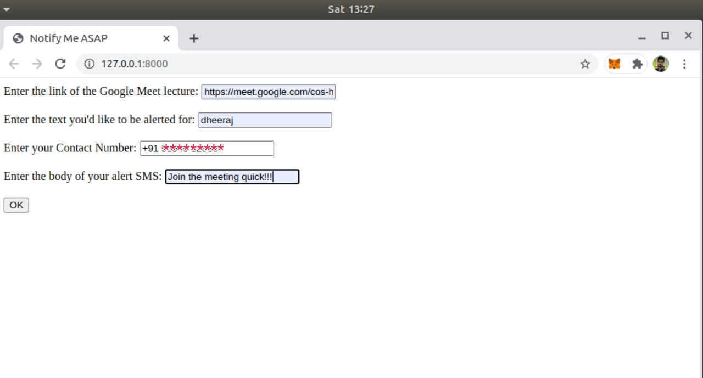
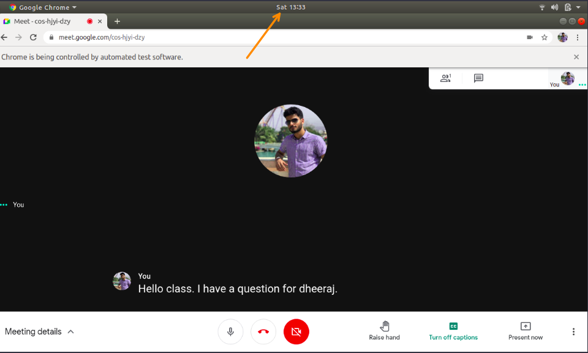
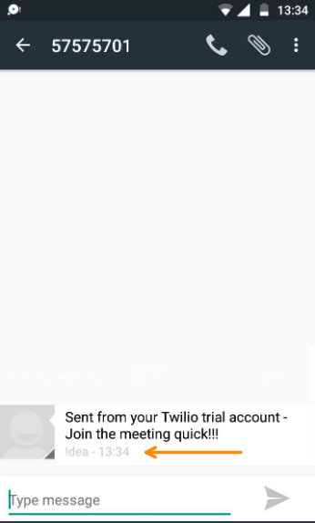

# Run-To-Meet
This is a Google Meet Notifier, which aims to protect students from the embarrassment of not being able to reply when somebody mentions their name in Online Lecture, while they mistakenly missed out their name being called out.

>You: So, is it reaalllly helpful??

>Me: Yes! it gets the job done, although there few more features we can add but in the meantime, see for yourself:

<b>1.) This is where you fill all the relevant details regarding your meeting<b>

>Note:
>- Link of the meeting
>- The text you'd like to be alerted to, which in my case is: "dheeraj"
>- Enter your contact number with country code
>- Body of the SMS you'd like to receive

<b>2.) This is your Online Lecture and at 13:33 your lecturer just called out your name<b>

<b>3.) But don't worry, within 3 seconds you'll get the SMS<b>

>Note: Due to very close timing, it may seem that I received the message after 1 whole minute (at 13:34) but that's not the case, I received it in 3 seconds!

Try it by yourself!!
